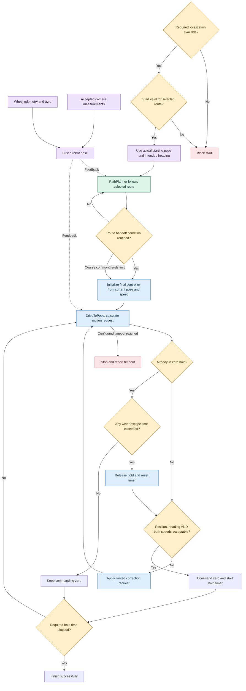
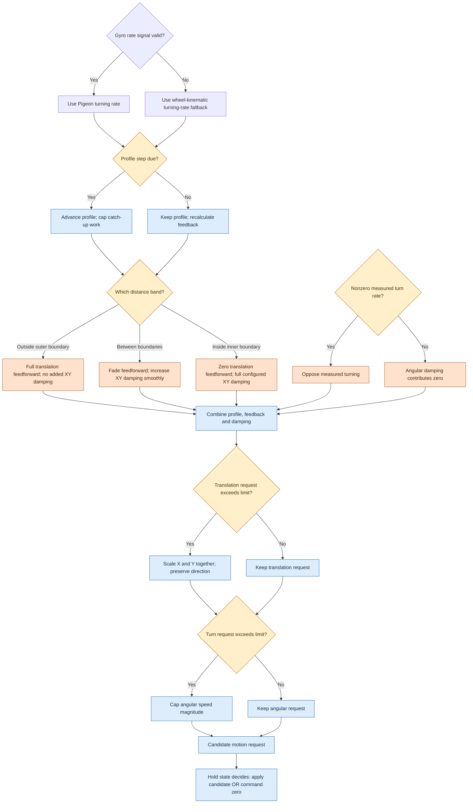

# Generic driving decisions

Open [the interactive map](algorithm-decision-map.html) for selectable boxes and explanations.
This describes our reusable **drive-to-stop pattern**. Coordinates, motion limits, handoff conditions,
distance bands, tolerances, and timeout are configuration values, not universal numbers.
Current VisionTest values appear only as examples in the interactive detail panel and the written
[test walkthrough](FUNCTIONAL_ALGORITHM_HANDOFFS.md#current-visiontest-example).

A handoff predicate is supplied by the route. The current test uses a field-X boundary.
Automatically choosing the handoff from braking distance and speed would require additional code.
Passing waypoints are a different completion pattern: this diagram's settle gate applies to a
destination where the robot must stop.

## Who owns driving?

The coarse-command completion branch reflects the current command composition: the final controller
starts when the coarse command ends naturally or the handoff predicate interrupts it.
Localization keeps running throughout.

## Small mechanisms inside DriveToPose

These cooperate on each update; they do not take turns owning the drivetrain.

**Damping** is an opposing contribution based on measured velocity, like a shock absorber.
Translation damping grows as the robot enters its final approach band.
Rotation damping is applied throughout active correction and scales with measured turn rate.
These contributions may reduce the net request without making the robot move backward or reverse its
turn. Other components are added before the request reaches the motors.

**Feedforward fading** reduces the planned translation-speed contribution near the goal.
**Feedback** still corrects position and heading errors.
**Hysteresis** uses different entry and escape limits to prevent repeated hold/release toggling.
These are separate mechanisms.

## Four distinct settle-entry decisions

| Decision | If yes | If no |
|---|---|---|
| Position error within configured tolerance? | Position qualifies | Entry cannot qualify |
| Heading error within selected tolerance? | Heading qualifies | Entry cannot qualify |
| Measured translation slow enough? | Translation speed qualifies | Entry cannot qualify |
| Measured turning slow enough? | Turn rate qualifies | Entry cannot qualify |

All four must pass together to **enter** the hold. Once holding, small failures of these tight entry
checks do not restart correction. Any wider position, heading, translation-speed, or turn-rate escape
violation releases the hold. A timeout or interruption also ends the command with zero requested motion.

## What stays shared and what varies?

- **Shared mechanisms:** profile, feedback, damping, speed limiting, settle/escape logic.
- **Route geometry:** start, target, heading, and handoff predicate.
- **Selected settings:** speed and acceleration limits, distance bands, damping strengths,
  entry/escape tolerances, hold duration, and timeout.
- **Current implementation limit:** many settings are shared constants today. Showing them as
  configurable conditions does not imply a per-route runtime settings interface already exists.
- **Test-only convention:** resetting heading to zero assumes a physically aligned test robot;
  a general route uses its intended starting heading.

The purple boxes estimate position; green follows the main route; blue calculates final corrections;
yellow changes behavior through a decision; orange shows damping-related contributions; red stops or
blocks motion. Colors supplement the labels.

Last source review: September 4, 2026. Keep this map and its interactive counterpart synchronized with
[the functional guide](FUNCTIONAL_ALGORITHM_HANDOFFS.md).
