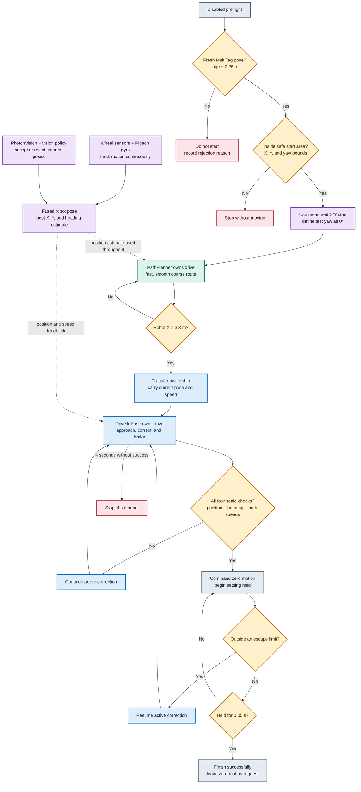

# Autonomous Algorithm Decision Map

This is the GitHub-friendly overview of the robot's current autonomous control flow. For clickable
boxes with explanations, terminology, and related AdvantageKit signals, open
[`algorithm-decision-map.html`](algorithm-decision-map.html) locally in a web browser.
For the complete written explanation, see
[`FUNCTIONAL_ALGORITHM_HANDOFFS.md`](FUNCTIONAL_ALGORITHM_HANDOFFS.md).

## Color key

- Purple: localization and pose information.
- Green: PathPlanner coarse driving.
- Blue: DriveToPose final positioning.
- Yellow: a decision, tolerance, or handoff boundary.
- Red: a blocked start or safety timeout.
- Gray: a control state or successful finish.

The dotted arrows show localization information being used by a driving algorithm. They are not
drivetrain handoffs. Only one scheduled driving command owns the wheels at a time.

Last checked against the robot code: September 4, 2026.
