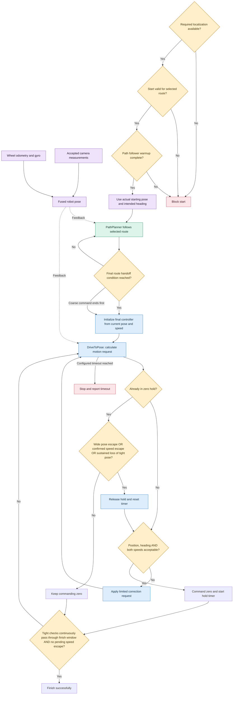
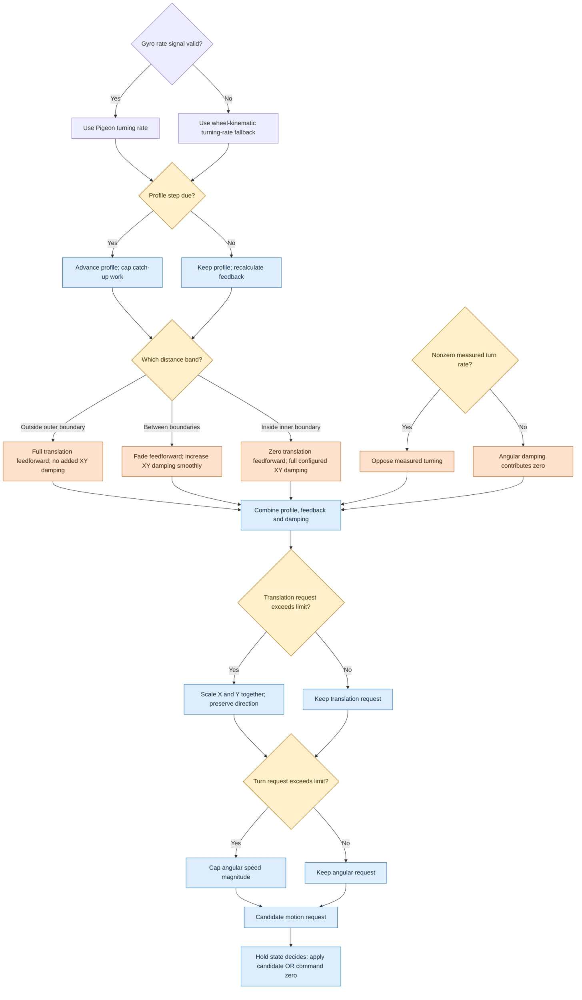

# MechaRAMS • How the robot decides to drive

September 28 stop-ownership rule: IF precision completes and the default joystick
command takes ownership while not in enabled teleop, THEN preserve the current
zero-drive/measured-angle hold. IF enabled teleop has neutral sticks, preserve it
too. IF actual joystick input or another driving command takes over, resume driving
normally. This is not continued field-pose correction after command success.
The owner can change without changing the steering targets. New Drive logs:
CommandOwner, PrecisionAngleHoldActive and ManualDriveAllowed (teleop-enabled mode).
No path/gain/finish-gate changes; this fixes a disturbance after completion,
separately from any earlier yaw ringing.

September 28 H4 post-finish protection: IF the precision controller begins
with more than 2.5° of heading correction OR gyro turn rate above 8°/s, mark
this attempt as a rotating finish. This decision uses the robot's measured
state, not H4's name or whether the PathPlanner route was curved. IF it is a
rotating finish, the existing pose/speed checks must also see every measured
wheel at or below .05 m/s and gyro yaw rate at or below 1.5°/s for the same
continuous 50 ms before completing. Otherwise retain the prior finish rule.
Both cases still enter measured-wheel-angle zero hold at <=.12 m/s chassis
translation and <=8°/s yaw and retain the same escape/recovery/timeout rules.
This applies to any DriveToPose attempt, including direct commands, but not
PathPlanner-only travel or H5's intermediate reversal. H3/H5's logged final
handoffs select the prior rule. No path/PID/camera change. Robot retest pending.

September 27 measured-angle stop experiment: IF final hold is entered, capture each actual
wheel angle once and command zero closed-loop drive at those angles. IF hold continues,
reuse the snapshot; IF an existing escape releases hold, resume correction and discard it.
This avoids chasing old steering targets during a stop. No X-lock or finish/gain/tolerance
change. DriveRequestType=VelocityAngleHold identifies it in logs; robot validation pending.

Successful finish requires uninterrupted tight pose/speed qualification for the configured
finish window during zero hold. A failed check resets that window, even if the wider hold
remains latched. Hold age alone cannot substitute for continuous good checks.

The translation-entry check uses the selected routine's configured radius, not necessarily one
global radius. The same radius governs sustained pose requalification. A tighter radius does
not alter PathPlanner geometry, handoff, gains or speeds, and is not guaranteed physical accuracy.

Stop-hold recovery also checks sustained loss of tight pose qualification: if position or heading
remains outside the finish limits for its configured confirmation window, return to correction.
Inside-limit samples reset that window. Immediate wider pose escape and separately confirmed
speed escape remain active; successful finish still requires current tight pose/speed checks.

**Team 999 · A visual guide for students, mentors, and the build team**

For the camera acceptance and position-estimation decisions, see the [localization decision trees](LOCALIZATION_DECISION_MAP.md).

[Who owns driving?](#who-owns-driving) · [Small control mechanisms](#small-mechanisms-inside-drivetopose) · [When do we stop?](#four-distinct-settle-entry-decisions) · [Explain the terms](#click-to-explore) · [What varies?](#what-stays-shared-and-what-varies)

> **The short version:** Localization tells us where we are. PathPlanner handles the main route.
> DriveToPose handles the final approach. Smaller mechanisms slow motion, limit corrections,
> and decide when to stop correcting so the robot does not keep twitching.

| Purple | Green | Blue | Yellow | Orange | Red |
|---|---|---|---|---|---|
| Locate the robot | Follow the route | Final corrections | Make a decision | Dampen motion | Block or stop |

Read the arrows in order; diamonds ask questions. Dashed arrows provide information rather than
transfer control. **Localization continues while either driving controller owns the wheels.**

<strong>Scope: generic rules, not one fixed test trajectory</strong>

This describes our reusable **drive-to-stop pattern**. Coordinates, motion limits, handoff conditions,
distance bands, tolerances, and timeout are configuration values, not universal numbers.
Fixed practice-field values are kept outside both generic maps, in a separate
[test configuration reference](VISIONTEST_CONFIGURATION_EXAMPLE.md). They are not navigation defaults.

A handoff predicate is supplied by the route. The current test uses a field-X boundary.
Automatically choosing the handoff from braking distance and speed would require additional code.
Passing waypoints are a different completion pattern: this diagram's settle gate applies to a
destination where the robot must stop.

<strong>Want the clickable-box version?</strong>

Download [algorithm-decision-map.html](algorithm-decision-map.html) using GitHub's download button,
then open the downloaded file in your browser. It is self-contained and works offline.
The repository file preview displays its source, not the interactive application.
This Markdown page is the version to share directly on GitHub: diagrams plus expandable explanations.

## Who owns driving?

```mermaid
flowchart TD
  Sensors["Wheel odometry and gyro"] --> Pose["Fused robot pose"]
  Vision["Accepted camera measurements"] --> Pose
  Start{"Required localization available?"} -- No --> Block["Block start"]
  Start -- Yes --> Valid{"Start valid for selected route?"}
  Valid -- No --> Block
  Valid -- Yes --> Warm{"Path follower warmup complete?"}
  Warm -- No --> Block
  Warm -- Yes --> Plan["Use actual starting pose and intended heading"]
  Plan --> PP["PathPlanner follows selected route"]
  Pose -. Feedback .-> PP
  PP --> H{"Final route handoff condition reached?"}
  H -- No --> PP
  H -- Yes --> Transfer["Initialize final controller from current pose and speed"]
  H -- "Coarse command ends first" --> Transfer
  Transfer --> Last["DriveToPose: calculate motion request"]
  Pose -. Feedback .-> Last
  Last --> Latched{"Already in zero hold?"}
  Latched -- No --> Entry{"Position, heading AND both speeds acceptable?"}
  Entry -- No --> Apply["Apply limited correction request"]
  Apply --> Last
  Entry -- Yes --> Zero["Command zero and start hold timer"]
  Latched -- Yes --> Escape{"Wide pose escape OR confirmed speed escape OR sustained loss of tight pose?"}
  Escape -- Yes --> Release["Release hold and reset timer"]
  Release --> Entry
  Escape -- No --> ZeroKeep["Keep commanding zero"]
  Zero --> Time{"Tight checks continuously pass through finish window AND no pending speed escape?"}
  ZeroKeep --> Time
  Time -- No --> Last
  Time -- Yes --> Done["Finish successfully"]
  Last -- "Configured timeout reached" --> Stop["Stop and report timeout"]
  classDef loc fill:#eee3fa,stroke:#7b4bb7,color:#251534;
  classDef path fill:#dcf4e9,stroke:#16835e,color:#10382b;
  classDef precise fill:#deedfb,stroke:#176fc1,color:#102f4d;
  classDef decision fill:#fff0cb,stroke:#b66b00,color:#4b3108;
  classDef safety fill:#fce5e8,stroke:#be3f4e,color:#4c1820;
  class Sensors,Vision,Pose,Plan loc;
  class PP path;
  class Transfer,Last,Apply,Release precise;
  class Start,Valid,Warm,H,Latched,Entry,Escape,Time decision;
  class Block,Stop safety;
```

The coarse-command completion branch reflects the current command composition: the final controller
starts when the coarse command ends naturally or the handoff predicate interrupts it.
Localization keeps running throughout.
The warmup is PathPlanner's official no-output command: it exercises follower code while disabled and
does not own or command the drivetrain. Current one-way holonomic tests use one continuous rounded
PathPlanner path. H2 hands off to DriveToPose at `0.30 m` from the final target; the other holonomic
tests use `0.55 m`. A holonomic handoff also requires the robot to be on the final straight, within
`0.05 m` cross-track, and moving within 30 degrees of that straight unless nearly stopped. Out-and-return uses
two continuous paths because it must stop and reverse at the far endpoint, then hands off near its
saved measured start.

## Small mechanisms inside DriveToPose

These cooperate on each update; they do not take turns owning the drivetrain.

```mermaid
flowchart TD
  Gyro{"Gyro rate signal valid?"} -- Yes --> UseGyro["Use Pigeon turning rate"]
  Gyro -- No --> UseWheels["Use wheel-kinematic turning-rate fallback"]
  UseGyro --> Timing
  UseWheels --> Timing
  Timing{"Profile step due?"}
  Timing -- Yes --> Advance["Advance profile; cap catch-up work"]
  Timing -- No --> Hold["Keep profile; recalculate feedback"]
  Advance --> Distance{"Which distance band?"}
  Hold --> Distance
  Distance -- "Outside outer boundary" --> Far["Full translation feedforward; no added XY damping"]
  Distance -- "Between boundaries" --> Near["Fade feedforward; increase XY damping smoothly"]
  Distance -- "Inside inner boundary" --> Inner["Zero translation feedforward; full configured XY damping"]
  Far --> Sum["Combine profile, feedback and damping"]
  Near --> Sum
  Inner --> Sum
  Rate{"Nonzero measured turn rate?"} -- Yes --> Damp["Oppose measured turning"]
  Rate -- No --> NoDamp["Angular damping contributes zero"]
  Damp --> Sum
  NoDamp --> Sum
  Sum --> XY{"Translation request exceeds limit?"}
  XY -- Yes --> Scale["Scale X and Y together; preserve direction"]
  XY -- No --> KeepXY["Keep translation request"]
  Scale --> R{"Turn request exceeds limit?"}
  KeepXY --> R
  R -- Yes --> Cap["Cap angular speed magnitude"]
  R -- No --> KeepR["Keep angular request"]
  Cap --> Candidate["Candidate motion request"]
  KeepR --> Candidate
  Candidate --> Override["Hold state decides: apply candidate OR command zero"]
  classDef decision fill:#fff0cb,stroke:#b66b00,color:#4b3108;
  classDef damping fill:#ffe2ce,stroke:#ab580d,color:#492408;
  classDef correction fill:#deedfb,stroke:#176fc1,color:#102f4d;
  class Timing,Distance,Rate,XY,R decision;
  class Far,Near,Inner,Damp,NoDamp damping;
  class Advance,Hold,Sum,Scale,KeepXY,Cap,KeepR,Candidate,Override correction;
```

**Damping** is an opposing contribution based on measured velocity, like a shock absorber.
Translation damping grows as the robot enters its final approach band.
Rotation damping is applied throughout active correction and scales with measured turn rate.
These contributions may reduce the net request without making the robot move backward or reverse its
turn. Other components are added before the request reaches the motors.

**Feedforward fading** reduces the planned translation-speed contribution near the goal.
**Feedback** still corrects position and heading errors.
**Hysteresis** uses different entry and escape limits to prevent repeated hold/release toggling.
These are separate mechanisms.

## Four distinct settle-entry decisions

| Decision | If yes | If no |
|---|---|---|
| Position error within configured tolerance? | Position qualifies | Entry cannot qualify |
| Heading error within selected tolerance? | Heading qualifies | Entry cannot qualify |
| Measured translation slow enough? | Translation speed qualifies | Entry cannot qualify |
| Measured turning slow enough? | Turn rate qualifies | Entry cannot qualify |

All four must pass together to **enter** the hold. Once holding, small failures of these tight entry
checks do not restart correction. Wider position or heading violations release the hold immediately.
Speed violations release it only after a continuous confirmation window; zero remains commanded while
confirmation is pending, and a clear speed sample resets the window. Success also requires current
tight pose/speed checks to pass with no pending confirmation. A timeout or interruption ends with zero.

## Click to explore

<strong>Why do we use two driving controllers?</strong>

**PathPlanner** follows the main route and its planned speeds. **DriveToPose** works toward the final
position and heading. IF the route's handoff condition is met, THEN the final controller takes over
using the robot's current pose and speed. In the current composition it also takes over if the
coarse command finishes first. This is not a universal "80 percent complete" rule.

<strong>Damping: the electronic shock absorber</strong>

IF the robot still moves, THEN damping adds a contribution opposing that measured motion.
Translation damping grows through the final approach band; rotational damping opposes measured
turning throughout active correction. It does not own the wheels or decide whether the command
has finished. Too much damping can make the approach slow.

<strong>Feedforward versus feedback: planned motion versus correction</strong>

**Feedforward** contributes the speed planned by the motion profile. **Feedback** corrects the
difference between the target and the measured state. IF the robot enters the final distance band,
THEN the planned translation contribution fades while translation damping grows. Position and
heading feedback remain available. The resulting combined request is then limited.

<strong>Why not finish as soon as position looks correct?</strong>

The robot can pass through the right position while still moving quickly or turning. IF position,
heading, translation speed, AND turn rate qualify together, THEN it enters zero hold. IF the hold
lasts long enough without an escape, THEN the command succeeds. A timeout stops the command but
does not mean the target was reached.

<strong>Hysteresis: how we avoid stop-correct-stop chatter</strong>

Entering zero hold requires the tighter limits. Leaving it requires a larger error or speed that
crosses a wider escape limit. IF a small fluctuation only crosses an entry limit, THEN keep holding
zero. IF position or heading escapes, THEN resume correction immediately. IF a speed violation
persists through the confirmation window, THEN resume correction and reset the hold timer.
During a shorter speed excursion, keep zero commanded and block completion.
This gap prevents small measurement fluctuations from constantly restarting corrections.

<strong>Sensor fallback, timing, and speed limits</strong>

IF the gyro rate signal is invalid, THEN use the turning rate estimated from wheel motion.
IF a profile step is due, THEN advance it with bounded catch-up work; otherwise keep the profile
while recalculating feedback. IF the combined translation request is too large, THEN scale X and Y
together to preserve direction. IF the turn request is too large, THEN cap it separately.
These mechanisms shape the request; they do not replace the controller.

<strong>How do the holonomic out-and-return tests work?</strong>

IF fresh MultiTag localization, PathPlanner warmup, or any generated target safety check fails, THEN
the route never moves. IF they all pass, THEN the robot uses one rounded PathPlanner path through its
forward, sideways, or diagonal geometry while yaw is controlled independently. IF H2 comes within
`0.30 m`, or another holonomic route comes within `0.55 m`, of the final target after the handoff has
armed, THEN DriveToPose takes over while the robot is still moving. IF out-and-return is selected,
THEN it uses two continuous paths and makes one
required stop/reversal at the outward point before retracing to the saved measured start. IF the
return reaches its final straight, THEN only that straight is capped at `0.70 m/s` before the final
handoff; this is a smooth approach limit, not another stop. A good return does not by itself prove
the outward point was accurate, so both points are measured.

<strong>Why is X-wheel “pizza” braking not in the moving baseline?</strong>

An X-wheel stance is a useful stationary parking posture, but it is not the same as a controlled
moving deceleration. Adding it during the first holonomic tests would change braking and geometry at
the same time. The baseline keeps ordinary closed-loop wheel control; X-wheel holding can be tested
later as an isolated experiment.

## What stays shared and what varies?

- **Shared mechanisms:** profile, feedback, damping, speed limiting, settle/escape logic.
- **Route geometry:** start, target, heading, and handoff predicate.
- **Selected settings:** speed and acceleration limits, distance bands, damping strengths,
  entry/escape tolerances, hold duration, and timeout.
- **Current implementation limit:** many settings are shared constants today. Showing them as
  configurable conditions does not imply a per-route runtime settings interface already exists.
- **Test-only convention:** resetting heading to zero assumes a physically aligned test robot;
  a general route uses its intended starting heading.

The purple boxes estimate position; green follows the main route; blue calculates final corrections;
yellow changes behavior through a decision; orange shows damping-related contributions; red stops or
blocks motion. Colors supplement the labels.

Last source review: September 6, 2026. Keep this map and its interactive counterpart synchronized with
[the functional guide](FUNCTIONAL_ALGORITHM_HANDOFFS.md).

---

[Back to top](#top) · [Documentation index](README.md) · [Detailed IF/THEN guide](FUNCTIONAL_ALGORITHM_HANDOFFS.md)

Maintainers: update this page, the interactive map, and the functional guide whenever behavior changes.
This page uses GitHub-supported [Mermaid diagrams](https://docs.github.com/en/get-started/writing-on-github/working-with-advanced-formatting/creating-diagrams)
and [expandable sections](https://docs.github.com/en/get-started/writing-on-github/working-with-advanced-formatting/organizing-information-with-collapsed-sections).
