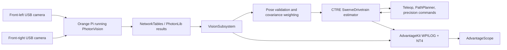

# Architecture and Deployment

This document explains how the `VisionTestingAndCalibration` prototype works, what ideas were adapted from other teams, and where each piece should run.

## System Goal

The project is a testbed for improving Team 999 localization and trajectory precision before the 2027 season.

The system should answer these questions:

- Can two USB global-shutter cameras on one Orange Pi provide useful AprilTag observations?
- Can the 2025 chassis drive repeatable paths with CTRE swerve and PathPlanner?
- Does a separate final-pose controller improve precision after coarse trajectory motion?
- Are logs detailed enough for AdvantageScope replay and AI-assisted debugging?
- What measurements are still missing before trusting this on a real robot?

## Runtime Topology

| Component | Runs On | Responsibility |
| --- | --- | --- |
| Java robot program | roboRIO in real mode, desktop in sim | CTRE swerve, command scheduling, final pose fusion, trajectory commands, logging |
| PhotonVision | Orange Pi in real mode | USB camera capture, AprilTag detection, pose solving, NetworkTables publishing |
| Arducam OV9782 cameras | USB2 connected to Orange Pi | Global-shutter AprilTag image capture |
| AdvantageKit logger | roboRIO/desktop robot program | WPILOG and NT4 live logging |
| AdvantageScope | Driver laptop | Live NT4 viewing and log replay |
| PathPlanner | Driver/programming laptop | Coarse trajectory creation |
| Driver Station | Driver laptop | Enable/disable, joystick input, robot mode control |

## Data Flow



## Robot Code Structure

| File | Role |
| --- | --- |
| `Constants.java` | Hardware IDs, swerve constants, camera transforms, tag layout, path constraints |
| `Robot.java` | AdvantageKit setup and mode lifecycle |
| `RobotContainer.java` | Subsystems, Xbox bindings, dashboard commands, autonomous chooser |
| `DriveSubsystem.java` | CTRE Phoenix 6 swerve drivetrain, PathPlanner AutoBuilder, SysId hooks, sim update loop |
| `VisionSubsystem.java` | PhotonVision result ingestion, pose validation, covariance selection, fusion into drivetrain |
| `DriveManuallyCommand.java` | Field-relative Xbox driving |
| `DriveToPosePrecisionCommand.java` | Final tolerance/settle pose controller |
| `mecharams-two-tag-layout.json` | Deployable custom AprilTag field layout |
| `AGENTS.md`, `CLAUDE.md`, `.claude`, `.codex` | AI workflow instructions and review templates |

## Team Ideas Adapted

No external team robot code was copied directly into the Java project in this pass. The project adapts patterns from the research documents and local reference files.

| Source | Idea Adapted | How It Appears Here |
| --- | --- | --- |
| 6328 Mechanical Advantage / Northstar / RobotState | Process every camera frame, sort by timestamp, reject physically impossible poses, weight by distance and tag count, log for replay | `VisionSubsystem` consumes `getAllUnreadResults()`, sorts observations by timestamp, rejects bad Z/outside-field/ambiguous/too-far poses, and logs accepted/rejected data |
| 6328 AdvantageKit ecosystem | Replayable logs as the primary debugging artifact | `Robot.java` starts AdvantageKit, writes sim logs, publishes NT4 |
| 125 NUTRONs | Simple conservative vision: trust translation more than heading, especially for single-tag solves | Single-tag observations get effectively infinite theta standard deviation |
| 1768 Nashoba / AdvantageKit + PhotonVision pattern | PhotonVision as coprocessor pipeline with robot-side fusion and structured logging | PhotonVision runs offboard; roboRIO performs final `addVisionMeasurement` |
| 3467 Windham / custom estimator discipline | Explicit pose validation and rejection reason logging | `VisionSubsystem` records rejection reasons rather than silently dropping data |
| 5687 Outliers / odometry and fusion references | Treat odometry/vision timing as first-class data | Timestamps are retained from PhotonVision and observations are applied in timestamp order |
| 2910/254/1678 style elite-code practice | Separate coarse autonomous motion from final precision mechanisms | PathPlanner auto is coarse; `DriveToPosePrecisionCommand` performs tolerance/settle final approach |
| 360, 1868, 6238, 6391, 4050 AI templates | Repo-level AI contracts, command templates, review checklists, session-state discipline | `AGENTS.md`, `CLAUDE.md`, `.claude/commands`, `.codex/skills`, `SESSION_STATE.md`, `AI_PROMPTS.md` |
| CTRE Phoenix 6 examples | Phoenix 6 generated-style swerve drivetrain and PathPlanner AutoBuilder | `DriveSubsystem` extends CTRE `SwerveDrivetrain` and configures PathPlanner |
| Team 999 2025 robot code | Actual 2025 chassis CAN IDs, bus name, Pigeon ID, module offsets | `Constants.SwerveConstants` uses the 2025 IDs and offsets |
| Team 999 2026 robot code | More understandable local CTRE drive style and SysId/PathPlanner concepts | `DriveSubsystem` keeps the local structure but strips unrelated game mechanisms |

## Vision Architecture

### Real Robot

1. Cameras send USB video to the Orange Pi.
2. PhotonVision detects AprilTags and solves robot pose.
3. PhotonLib exposes unread results to the Java robot program.
4. The robot consumes all results from both cameras.
5. Each result is validated:
   - Must use at least one tag.
   - Pose Z must be physically plausible.
   - Pose must be inside or near the test field.
   - Average distance must not be too large.
   - Single-tag ambiguity must be below threshold.
6. Accepted observations are sorted by timestamp.
7. Each observation gets standard deviations:
   - XY grows with distance squared.
   - XY shrinks with tag count squared.
   - Theta is trusted only with multi-tag solves.
8. The drivetrain estimator receives `addVisionMeasurement`.
9. AdvantageKit records enough data to analyze acceptance, rejection, and timing.

### Why Final Fusion Stays On The roboRIO

The current recommendation is to offload image processing, not final drivetrain control.

Reasons:

- PhotonVision/Orange Pi handles the expensive camera work.
- CTRE drivetrain control and robot safety stay deterministic on the roboRIO.
- Moving final control offboard would require a larger infrastructure project with failover, time sync, deterministic networking, and hardware IO separation.
- Logs should prove a bottleneck before moving fusion/control offboard.

## Trajectory Architecture

There are two layers:

1. Coarse path following.
2. Final precision approach.

PathPlanner handles coarse motion. It is good for repeatable path shape, velocity limits, and field-relative routing.

`DriveToPosePrecisionCommand` handles the last step. It drives to a target pose, checks translation/rotation tolerance, and requires a settle time. This follows the researched pattern that final scoring/positioning precision is often better handled by a dedicated final alignment controller than by expecting a path to end perfectly.

## Logging Architecture

AdvantageKit is used because it supports:

- Replay-oriented debugging.
- Live NT4 publishing.
- Log files students and AI tools can inspect later.
- Lower dashboard spam compared with ad hoc SmartDashboard writes.

Current log outputs include:

- Vision accepted/rejected counts.
- Per-camera raw and accepted poses.
- Tag count.
- Average target distance.
- Rejection reason.
- Vision periodic runtime.

Recommended follow-up logs:

- Precision target pose.
- Final pose.
- Final translation error.
- Final rotation error.
- Command settle time.
- Per-subsystem periodic timing.

## Deployment Plan

### Robot Code Deployment

Runs on the roboRIO.

1. Install Java 17+ / WPILib 2026 tooling.
2. Compile with:

```powershell
cd 'S:\MechaRAMS\2027Prototyping\VisionTestingAndCalibration'
.\gradlew.bat compileJava
```

3. Fix any compile/API mismatches.
4. Connect to the robot network.
5. Deploy from WPILib VS Code with `WPILib: Deploy Robot Code`, or run:

```powershell
.\gradlew.bat deploy
```

Do not deploy until compile succeeds.

### Orange Pi Deployment

Runs PhotonVision.

1. Image/install PhotonVision for Orange Pi.
2. Connect both Arducam USB cameras.
3. Set camera names exactly:
   - `front-left`
   - `front-right`
4. Calibrate both cameras at the resolution used for testing.
5. Load the custom AprilTag layout:
   `src/main/deploy/apriltags/mecharams-two-tag-layout.json`
6. Configure robot-to-camera transforms from measured mounts.
7. Set exposure so tags are crisp and not overexposed.
8. Put the Orange Pi on the robot network where the roboRIO can receive NetworkTables data.

### Driver Laptop Deployment

Runs:

- Driver Station.
- AdvantageScope.
- PathPlanner when editing paths.
- PhotonVision web UI when configuring the Orange Pi.

### Data Collection Deployment

1. Enable robot.
2. Run a short test.
3. Disable.
4. Copy logs from `/home/lvuser/logs` if on robot, or use live AdvantageScope.
5. Store logs with the date, test name, camera transforms, tag layout, and notes.

## Configuration That Must Match

| Item | Robot Code | PhotonVision / Physical Setup |
| --- | --- | --- |
| Camera names | `front-left`, `front-right` | Must match exactly |
| Tag IDs | 1 and 2 | Printed tags must match |
| Tag size | 6.5 in / 0.1651 m | Print at exact size |
| Tag poses | Custom layout JSON and `VisionConstants` | Board must be placed accordingly |
| Camera transforms | `VisionConstants` | Must be measured after mounting |
| CAN bus | `canivore1` | 2025 chassis wiring |
| Pigeon ID | 40 | 2025 chassis wiring |

## Known Technical Debt

- Java 17 must be available before compile verification.
- Full PhotonVision simulation is not implemented yet.
- Camera transforms are recommended starting values, not measured values.
- Drivetrain characterization remains provisional.
- The `VisionTest` PathPlanner auto file still needs to be created.
- A full AdvantageKit IO-layer architecture may be worth adding after the pilot compiles and drives.

## Recommended Next Development Order

1. Install/use Java 17+ and compile.
2. Fix compile errors.
3. Add final-error logging to `DriveToPosePrecisionCommand`.
4. Add PhotonVision simulation hooks.
5. Create `VisionTest` PathPlanner auto.
6. Run desktop simulation and inspect AdvantageKit logs.
7. Mount cameras and measure transforms.
8. Calibrate cameras in PhotonVision.
9. Run static tag-board tests.
10. Run slow precision drive tests.
11. Characterize drivetrain.
12. Re-test path plus precision controller.
