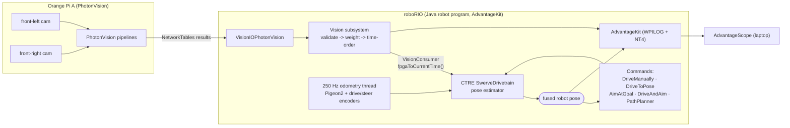

# Architecture and Deployment

Authoritative "how it all works" document for the `VisionTestingAndCalibration` prototype, both at a
high level and in detail. Current as of the 2026-06-30 Claude best-in-breed rebuild.

Companion docs: `CODEX_CODE_REVIEW_AND_GAP_ANALYSIS.md` (why the code is shaped this way),
`DESIGN_DECISIONS_AND_REJECTED_IDEAS.md` (what we chose not to do), `CALIBRATION_AND_TEST_PROCESS.md`
(how to calibrate/test), `ADVANTAGESCOPE_SETUP.md` (visualization), `ROBOT_CONTROLS.md` (bindings).

---

# Part 1 — High Level

## 1.1 What the system is

A testbed for **high-precision localization, precision driving, and chassis aiming** on Team 999's 2025
swerve chassis, built so the entire pipeline can be validated **in simulation before hardware**. It
deliberately adopts the measurement discipline of top published teams (6328, 3467, 1768, 6995) without
their custom compute hardware.

It answers:

- Can global-shutter USB cameras on Orange Pi(s) give trustworthy AprilTag pose corrections?
- Can the chassis reach a target pose repeatably (drive precisely)?
- Can the chassis stay aimed at a field point while still or moving?
- Are the logs good enough to debug all of the above by replay?

## 1.2 The three layers (the key mental model)

Everything is organized as three layers with a strict division of labor. This is the single most
important idea in the architecture — it is how we get most of 6328's benefit without their Mac mini.

```
  PERCEPTION  (Orange Pi, PhotonVision)   -> turns camera images into tag detections + pose solves
       |  NetworkTables (timestamped results)
       v
  FUSION      (roboRIO, Java)             -> validates, weights, time-orders, and fuses into one pose
       |  one estimated pose
       v
  CONTROL     (roboRIO, Java)             -> teleop, precision driving, aiming, autonomous use the pose
```

- **Perception is offboard** because image processing is expensive — that is the part worth moving to a
  coprocessor.
- **Fusion and control stay on the roboRIO** because they are cheap, must be deterministic, and are
  safety-relevant. We do **not** move them to the Orange Pi (no Mac-mini-style offboard brain).

## 1.3 Where each piece runs



In **simulation** the only change is the perception layer: `VisionIOPhotonVisionSim` replaces the real
camera IO and is fed the true simulated pose, so PhotonVision renders synthetic frames through the same
NetworkTables path. Everything downstream (fusion, control, logging) runs identically.

## 1.4 Hardware baseline

- **Coprocessor:** Orange Pi running PhotonVision (NOT a Mac mini). Start with **1 Pi**.
- **Cameras:** **2** Arducam OV9782 (1280×800 global-shutter color USB2) to start. Code scales to **4
  cameras / 2 Pis** (2 per Pi — the established-safe Orange Pi budget) by uncommenting two lines.
- **roboRIO + CANivore:** runs the Java program, the 250 Hz odometry thread, fusion, and control.
- **Important:** the 250 Hz figure is the roboRIO/CANivore odometry sampling rate (gyro + encoders over
  CAN FD). It is **not** a camera or Orange Pi rate — cameras run ~30–50 fps and are fused by timestamp
  against the dense odometry history.

---

# Part 2 — Detailed Design

## 2.1 Robot code map

| File | Role |
| --- | --- |
| `Constants.java` | All tunables: swerve hardware (2025 CAN IDs/offsets), `VisionConstants` (layout, camera names/transforms, gates, covariance, sim-camera model), `AutoConstants` (precision gains/profile/timeout), `AimConstants` (goal, gains, shoot-on-move model) |
| `Robot.java` | `LoggedRobot` lifecycle; starts AdvantageKit (WPILOG + NT4); schedules autonomous |
| `RobotContainer.java` | Builds subsystems, selects real/sim vision IO, wires the `VisionConsumer` (with the timestamp fix), controller bindings, dashboard, auto chooser |
| `subsystems/DriveSubsystem.java` | CTRE Phoenix 6 `SwerveDrivetrain`; 250 Hz odometry; PathPlanner `AutoBuilder`; SysId; 5 ms sim thread; logs the fused pose |
| `subsystems/vision/VisionIO.java` | `@AutoLog` inputs + `PoseObservation`/`TargetObservation` records (the replayable boundary) |
| `subsystems/vision/VisionIOPhotonVision.java` | Real camera: drains all frames, solves multi-tag + single-tag robot poses |
| `subsystems/vision/VisionIOPhotonVisionSim.java` | `VisionSystemSim` + `PhotonCameraSim` (OV9782 model), fed the true sim pose |
| `subsystems/vision/Vision.java` | Validation gates, adaptive covariance, timestamp-ordered fusion via `VisionConsumer`, structured logging |
| `commands/DriveManuallyCommand.java` | Field-relative teleop default command |
| `commands/DriveToPosePrecisionCommand.java` | Profiled final-pose controller (FF + settle + safety timeout + logging) + coarse→precise handoff helper |
| `commands/AimAtGoalCommand.java` | Stationary "square up to the goal" with settle |
| `commands/DriveAndAimCommand.java` | Driver translates while the robot auto-faces the goal (shoot-on-move) |
| `util/AimingCalculator.java` | Pure, unit-tested aiming geometry + shoot-on-move lookahead |
| `util/TimingTracer.java` | Per-subsystem loop timing into `Timing/*` |
| `src/test/...` | Headless JUnit tests (`VisionPolicyTest`, `AimingCalculatorTest`) |

## 2.2 Vision: the IO-layer (why it is split)

The vision code follows the **AdvantageKit IO-layer pattern** (the official PhotonVision template,
6328-authored, shipped by 1768). The camera is hidden behind `VisionIO`, whose inputs are captured into
an `@AutoLog` struct each loop. The benefit is **deterministic replay**: the fusion policy in `Vision`
re-runs identically against recorded inputs, so a bug can be diagnosed from a log without the robot.

- `VisionIO.VisionIOInputs` (`@AutoLog`) holds: `connected`, `latestTargetObservation` (a tag bearing,
  kept for a future boresight loop), `poseObservations[]`, `tagIds[]`.
- `PoseObservation(timestamp, Pose3d pose, ambiguity, tagCount, averageTagDistance)` is one frame's
  field-relative robot-pose solve.
- The `@AutoLog` companion (`VisionIOInputsAutoLogged`) is generated by the AdvantageKit annotation
  processor (wired in `build.gradle`).

### Real vs simulated IO (one swap)

`RobotContainer.createVision()` picks `VisionIOPhotonVisionSim` when `RobotBase.isSimulation()`,
otherwise `VisionIOPhotonVision`. Both speak the same `VisionIO`. The sim version owns a shared
`VisionSystemSim` with the tag layout and a per-camera `PhotonCameraSim` modeled on the OV9782
(resolution, FOV, FPS, latency, pixel noise from `VisionConstants.SIM_CAMERA_*`); each loop it calls
`visionSim.update(truePose)` and then the **real** ingestion code runs unchanged.

## 2.3 Vision: the fusion pipeline (step by step)

`VisionIOPhotonVision.updateInputs()` (per camera, each loop):

1. `getAllUnreadResults()` — drains **every** queued frame (PhotonVision can buffer several between 50 Hz
   loops; dropping them throws away corrections).
2. Multi-tag: uses the coprocessor's combined PnP `field→camera`, composes with the inverse
   robot→camera transform to get the robot pose.
3. Single-tag: reconstructs the robot pose from the known tag pose in the custom layout.
4. Emits `PoseObservation`s + tag IDs into the logged inputs.

`Vision.periodic()` (the fusion policy):

1. `updateInputs` + `Logger.processInputs` for each camera (this is what makes it replayable).
2. **Early-auto guard** — ignore vision for the first `AUTO_VISION_IGNORE_SECONDS` of autonomous so a
   stray frame cannot move the known start pose (idea: 6328).
3. For each observation, run `rejectionReason(...)` — gates, in order: no tags → NaN/Inf → impossible Z
   → off-field → too far → ambiguous single tag. Rejections are logged with a `RejectionReason` **enum**
   (idea: 3467) and the pose is drawn to `Vision/Summary/RejectedPoses`.
4. Accepted observations get **adaptive covariance** from `standardDeviations(...)`:
   `xy = LINEAR_BASELINE · dist² / tagCount · cameraFactor`, and
   `theta = (tagCount ≥ 2) ? ANGULAR_BASELINE · dist² / tagCount · cameraFactor : +Infinity`.
   **Single-tag heading is never trusted** (theta = +∞) — the exact 2026 bug this project exists to fix
   (idea: 6328 / 125).
5. The accepted pose, its capture timestamp, and the covariance go to the `VisionConsumer`.

### The timestamp time-base (critical detail)

The `VisionConsumer` is wired in `RobotContainer` as:
`(pose, ts, stdDevs) -> drive.addVisionMeasurement(pose, Utils.fpgaToCurrentTime(ts), stdDevs)`.
PhotonVision timestamps are in the **WPILib FPGA** time base; CTRE's `SwerveDrivetrain` odometry buffer is
on the **Phoenix** time base. They must be converted with `Utils.fpgaToCurrentTime(...)` or every sample
fuses against the wrong odometry sample and latency compensation silently breaks. (This was a real bug in
the first pass.)

## 2.4 Drivetrain and the estimator

`DriveSubsystem extends SwerveDrivetrain<TalonFX, TalonFX, CANcoder>`:

- **Estimator:** CTRE's built-in pose estimator. A background thread samples the Pigeon2 + drive/steer
  encoders at **250 Hz** over CAN FD and maintains an odometry buffer; `addVisionMeasurement(pose, t,
  stdDevs)` fuses a vision sample at its (converted) timestamp against that buffer. We kept CTRE's
  estimator (rather than a custom one) for integration and simplicity — see
  `DESIGN_DECISIONS_AND_REJECTED_IDEAS.md` for when to revisit.
- **Requests:** field-centric teleop, robot-centric (precision/aiming), `ApplyRobotSpeeds` (PathPlanner),
  and three SysId characterization requests.
- **PathPlanner:** `AutoBuilder.configure(...)` wires pose/reset/speeds/output once, with CTRE force
  feedforwards passed through.
- **Simulation:** a 5 ms `Notifier` runs `updateSimState(...)`.
- **Logging:** `periodic()` logs `Drive/Pose`, `Drive/Speeds`, and module states/targets (this was the
  missing fused-pose logging).

## 2.5 Precision driving

`DriveToPosePrecisionCommand` finishes a precise move that a time-based path should not:

- **Profiled** `ProfiledPIDController` on field x, y, and θ, each with a trapezoid profile that
  decelerates to zero velocity exactly at the goal, plus the profile's velocity as feedforward (idea:
  1768 `driveToPose`; 6328 FF-fade). Output is converted to robot-relative speeds.
- **Settle gate:** success requires holding translation+rotation tolerance for `PRECISION_SETTLE_SECONDS`
  (idea: 1768 `cmdWithAccuracy`).
- **Safety timeout:** ends (logging `TimedOut=true`) after `PRECISION_SAFETY_TIMEOUT_SECONDS` so a bad
  target cannot hang it (idea: 1768).
- **Logging:** target, measured, translation/rotation error, settle, finished — satisfying the AGENTS.md
  precision-logging rule (idea: 6328).
- **Handoff:** `handoffFrom(coarsePath, spatialCondition)` runs a path until a spatial condition, then
  finishes on this controller (idea: 6328 `DriveTrajectory.andThen(DriveToPose)`). Exposed as the
  "VisionTest + Precision Handoff" auto.

## 2.6 Chassis aiming (no turret/mechanism)

The whole chassis points at a configurable virtual goal (`AimConstants.GOAL_POSITION`) — useful for a
future shooting OR placing game; only the goal point changes.

- `AimingCalculator` (pure, unit-tested): heading = `atan2(goal − robot)` + aim-face offset (idea: 6995
  `aimAtFieldPose`, 1768 `ShootingUtil`). `solveMoving` iterates a velocity-led "future pose" with a
  modeled time-of-flight (idea: 6328 `LaunchCalculator` / 1768 `ShootingUtil` shoot-on-move). The lead is
  *opposite* the motion (verified in `AimingCalculatorTest`).
- `AimAtGoalCommand`: stationary square-up with a profiled heading controller + settle + safety timeout.
- `DriveAndAimCommand`: driver keeps field-relative translation; the robot auto-rotates to the aim
  heading and leads its motion (idea: 1768 `joystickDriveAtAngle`).
- Logs `Aim/TargetHeadingDegrees`, `Aim/HeadingErrorDegrees`, `Aim/LeadPose`, `Aim/GoalPose` — including
  the `poseBearing` the strategy doc wants as an independent aim check. No shooter/hood/turret/GPM.

## 2.7 Logging and replay

AdvantageKit (`LoggedRobot`) writes WPILOG (`logs/sim` in sim, `/home/lvuser/logs` on the robot) and
publishes NT4 live. Vision **inputs** are captured via `Logger.processInputs` (replayable); fusion
verdicts, the fused pose, precision errors, and aiming are recorded as outputs. The result is one set of
channels that works identically live and in replay, and that `ADVANTAGESCOPE_SETUP.md` turns into a
robot-on-field view.

## 2.8 Controls and autonomous

Single Xbox controller (see `ROBOT_CONTROLS.md`): left stick translate, right stick rotate, slow mode,
pose reset, precision drive, stationary aim (right-stick press), drive-and-aim (right trigger), and SysId
selection/execution. The auto chooser offers `No Auto`, `Precision To Tag Board`, `PathPlanner Auto:
VisionTest`, and `VisionTest + Precision Handoff`; a missing PathPlanner auto is non-fatal.

---

# Part 3 — Team Ideas Adapted (where each came from)

| Source | Idea | Where it lives now |
| --- | --- | --- |
| 6328 + AdvantageKit PhotonVision template (1768) | IO-layer vision for replay; consume all frames; accepted/rejected logging | `subsystems/vision/*` |
| 6328 `Vision.java` | Single-tag heading = +∞; per-camera std-dev factor; ignore vision early in auto | `Vision.standardDeviations`, `AUTO_VISION_IGNORE_SECONDS` |
| 6328/Northstar | `dist²/tagCount` adaptive covariance; reject physically impossible poses | `Vision` covariance + gates |
| 3467 `PoseEstimator` | Structured rejection-reason enums; innovation logging (pragmatic n-σ) | `Vision.RejectionReason`, `LastInnovationMeters` |
| 1768 `VisionIOPhotonVisionSim` + 3467 sim properties | PhotonVision simulation with a realistic camera model | `VisionIOPhotonVisionSim` |
| CTRE Phoenix 6 + vision integration note | `SwerveDrivetrain` estimator; **`fpgaToCurrentTime` timestamp conversion** | `DriveSubsystem`, `RobotContainer.createVision` |
| 1768 `driveToPose` / 6328 `DriveToPose` | Profiled x/y/θ + FF fade; full logging | `DriveToPosePrecisionCommand` |
| 1768 `cmdWithAccuracy` | Settle gate + safety timeout | `DriveToPosePrecisionCommand` |
| 6328 `AutoCommands` | Coarse→precise spatial handoff | `handoffFrom`, handoff auto |
| 6995 `TurretS` / 1768 `ShootingUtil` / 6328 `LaunchCalculator` | Chassis aim to a field goal; shoot-on-move lookahead | `AimingCalculator`, aim commands |
| 2910/254/1678 lineage | Coarse trajectory + dedicated final controller | precision + handoff |
| Team 999 2025 robot code | Real CAN IDs, bus name, Pigeon ID, module offsets | `Constants.SwerveConstants` |
| 360/1868/6238/4050 AI templates | Repo AI contracts, skills, prompt templates, session-state discipline | `AGENTS.md`, `.codex/skills`, `.claude/commands`, `AI_REGENERATION_PROMPTS.md` |

What we did **not** adopt (custom estimator, skid/tilt logic, turret, Choreo-as-active, Mac-mini offboard)
and why is in `DESIGN_DECISIONS_AND_REJECTED_IDEAS.md`.

---

# Part 4 — Deployment

## 4.1 roboRIO (robot code)

1. Java 17+ / WPILib 2026.
2. `./gradlew.bat compileJava` and `./gradlew.bat test` must pass.
3. Connect to the robot network; deploy via VS Code `WPILib: Deploy Robot Code` or `./gradlew.bat
   deploy`. Do not deploy until compile succeeds.

## 4.2 Orange Pi(s) (PhotonVision)

Start with **1 Pi, 2 cameras**:

1. Image/install PhotonVision; connect both Arducams.
2. Name cameras exactly `front-left`, `front-right` (must match `VisionConstants`).
3. Calibrate each camera at the test resolution (`CALIBRATION_AND_TEST_PROCESS.md` Stage 2).
4. Set each camera's robot→camera transform from measured mounts (Stage 3).
5. Load the custom layout `src/main/deploy/apriltags/mecharams-two-tag-layout.json`.
6. Put the Pi on the robot network so the roboRIO receives NetworkTables.

Scale to **4 cameras / 2 Pis** later: add `back-left`/`back-right` on a second Pi, uncomment the two IO
lines in `RobotContainer`, and measure/confirm the `ROBOT_TO_BACK_*` transforms. Each Pi independently
publishes — one Pi failing does not blind the robot.

## 4.3 Driver/programming laptop

Driver Station, AdvantageScope (live + replay — see `ADVANTAGESCOPE_SETUP.md`), PathPlanner (editing
paths), and the PhotonVision web UI.

## 4.4 Configuration that must match (robot code ↔ physical setup)

| Item | Robot code | Physical / PhotonVision |
| --- | --- | --- |
| Camera names | `front-left`, `front-right` (+ `back-*` at 4 cams) | Must match exactly, globally unique |
| Tag IDs / size | 1 and 2, 6.5 in (0.1651 m) | Printed tags |
| Tag poses | `VisionConstants.CUSTOM_FIELD_LAYOUT` + deploy JSON | Board placement |
| Camera transforms | `VisionConstants.ROBOT_TO_*` | Measured after mounting |
| CAN bus / Pigeon | `canivore1` / ID 40 | 2025 chassis wiring |

---

# Part 5 — Known Technical Debt / Next Steps

- Camera intrinsics + extrinsics are provisional until calibrated/measured (Stages 2–3).
- Drivetrain characterization (SysId) still provisional (Stage 5).
- Custom estimator features (skid rejection, tilt distrust, true n-σ gate) are documented hooks, not
  implemented — would require replacing CTRE's estimator.
- Choreo is documented as the upgrade path but PathPlanner is the active tool.
- Drivetrain inputs are not behind an AdvantageKit IO layer (vision is); full drivetrain replay would be
  a larger change.

Recommended order: verify in sim (Stage 1) → calibrate (2–3) → localization accuracy (4) → characterize
(5) → precision (6) → aiming (7).
