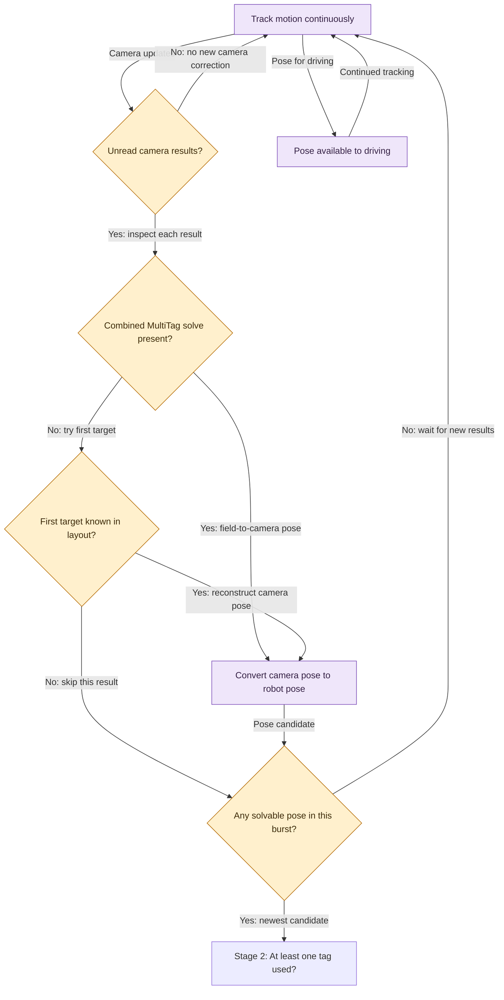
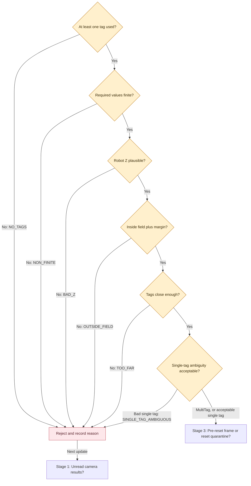
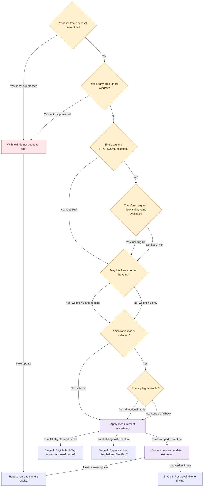
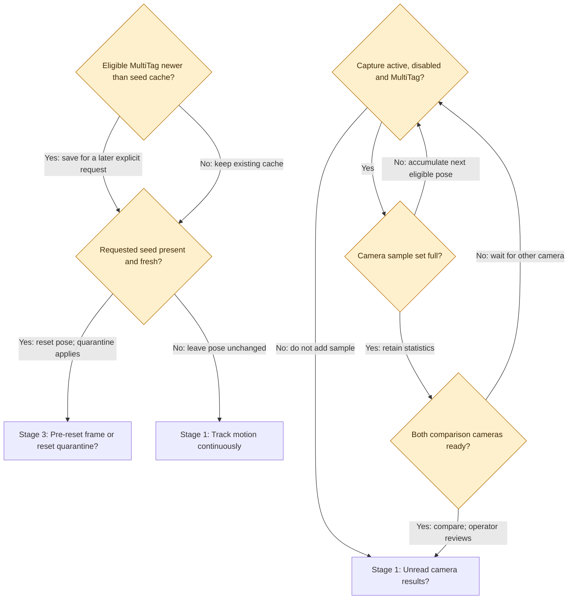

# MechaRAMS · Localization decisions

**How the robot decides where it is — generic conditions, not test coordinates.**

[Driving guide](ALGORITHM_DECISION_MAP.md) · [Interactive localization file](localization-decision-map.html)

Download the HTML file and open it in a browser for selectable boxes and definitions. GitHub renders the diagrams below; expand any explanation beneath them.

Purple means calculation/estimate, yellow a decision, red reject/withhold. Each camera runs the main pipeline independently. Wheel/gyro odometry continues between camera corrections. Boxes labeled as another stage connect to that section, not to an extra algorithm.

## 01 · Camera → robot pose

<strong>Track motion continuously</strong>

Wheel motion and the gyro maintain the drivetrain pose between camera updates. Losing a camera does not freeze localization, but wheel-based drift can grow.

- **odometry:** Estimating movement from wheel and heading measurements.

<strong>Unread camera results?</strong>

For each camera, record connection status and drain all unread results. A disconnected alert is diagnostic; the code does not use connection status as a separate pose-rejection gate.

- **frame:** One camera result captured at a particular time.

<strong>Combined MultiTag solve present?</strong>

Use the coprocessor's combined solution when present and targets are nonempty. Seeing two target outlines alone does not prove a combined solve exists.

- **MultiTag:** A combined position solution using multiple tags.

<strong>First target known in layout?</strong>

Without a combined solve, use the first detected target only if its ID exists in the robot field layout. No targets or unknown first tag means no pose from this result.

- **layout:** Known field positions and orientations of the tags.

<strong>Convert camera pose to robot pose</strong>

Compose field-to-camera with the inverse robot-to-camera transform. Camera mounting offsets, mounting angles, field layout, and camera calibration must be correct; stable output can still be biased.

- **transform:** A translation and rotation relating two coordinate frames.
- **extrinsics:** Camera position and angle relative to the robot.
- **intrinsics:** Lens and image geometry obtained through camera calibration.

<strong>Any solvable pose in this burst?</strong>

After inspecting the whole burst, keep only the candidate with the newest capture timestamp. Count the others as superseded. Selection happens BEFORE quality gates: an older good candidate is not retried if the newest one fails.

- **superseded:** Replaced by a newer candidate rather than rejected for quality.

<strong>Pose available to driving</strong>

The drivetrain's current combined estimate is available to trajectory and aiming controllers. Odometry updates it even without new vision; accepted timestamped camera measurements can correct it. Localization itself never commands wheel motion.

**Pose:** Position and heading together.

## 02 · Quality checks

<strong>At least one tag used?</strong>

Check the number of tags used in the solve. Failures are logged as NO_TAGS. Quality gates run in this order; the first failure determines the reason.

<strong>Required values finite?</strong>

Check X, Y, Z, yaw, average tag distance, and ambiguity for NaN or infinity. This gate does not separately check every possible field, such as timestamp or roll/pitch.

- **finite:** A real numerical value rather than undefined or infinite.

<strong>Robot Z plausible?</strong>

Compare the absolute estimated robot-reference height against the configured allowance. This is robot Z, not the tag height or camera mounting height.

- **Z:** Vertical coordinate; a level floor robot reference is expected near the floor.

<strong>Inside field plus margin?</strong>

Check X and Y against the configured field dimensions and border allowance.

<strong>Tags close enough?</strong>

Compare average camera-to-tag distance against the accepted range limit.

<strong>Single-tag ambiguity acceptable?</strong>

For one-tag solves, unknown negative ambiguity or ambiguity above the limit is rejected. MultiTag skips this check. The check still applies before optional trig solving.

- **ambiguity:** How uncertain the choice is between possible camera pose solutions.

<strong>Reject and record reason</strong>

Do not send this observation to the estimator. Update rejection logs; continue odometry and process future frames.

- **rejection:** A measurement failed a quality check.

## 03 · Timing → fusion

<strong>Pre-reset frame or reset quarantine?</strong>

Withhold captures older than the last pose reset and observations during the short post-reset quarantine. They do not count as quality-rejected frames.

- **quarantine:** A short pause in camera fusion after resetting pose.

<strong>Inside early-auto ignore window?</strong>

A validated frame is withheld during the configured initial enabled-autonomous window. Outside enabled auto this gate allows fusion.

<strong>Withhold, do not queue for later</strong>

Log reset suppression or autonomous suppression separately. This observation is not fused later by this layer.

- **suppression:** A usable-looking measurement is deliberately withheld because of timing.

<strong>Single tag and TRIG_SOLVE selected?</strong>

The original PnP pose already passed quality and timing gates. Optional trig mode replaces its XY; other observations retain their PnP pose.

- **PnP:** Estimating pose from known points and their image locations.
- **TRIG_SOLVE:** Calculate single-tag XY using known tag geometry and historical robot heading.

<strong>Transform, tag and historical heading available?</strong>

Trig solving needs the camera transform, known primary tag, and heading sampled at capture time. If any is missing, fall back to the already validated PnP pose.

- **history:** Saved robot poses that let the code retrieve heading at the frame's timestamp.

<strong>May this frame correct heading?</strong>

All must be true: multiple tags, camera rotation trust enabled, and either robot disabled or vision rotation allowed while enabled. Otherwise XY may still contribute, but angular standard deviation is infinite.

- **standardDeviation:** Estimated measurement uncertainty; larger values mean less influence.

<strong>Anisotropic model selected?</strong>

Isotropic is the baseline equal-X/Y noise model. The optional directional model uses separate range and sideways uncertainties; its coefficients are provisional pending fitting.

- **isotropic:** Equal uncertainty in X and Y.
- **anisotropic:** Different uncertainty depending on direction.

<strong>Primary tag available?</strong>

The directional model needs the robot-to-tag field angle. If the primary tag lookup fails, use the isotropic baseline.

- **ray:** The direction from estimated robot position toward the tag.

<strong>Apply measurement uncertainty</strong>

Baseline uncertainty grows with distance and shrinks with more tags. Configured per-camera XY and angular factors are independent. Larger factors reduce influence. Jitter capture does not automatically update them.

- **covariance:** A description of uncertainty used to decide measurement influence.

<strong>Convert time and update estimator</strong>

Convert the capture timestamp from FPGA to Phoenix time, then submit robot pose and standard deviations to CTRE. Wheel/gyro localization continues. The result is the pose consumed by driving controllers, not a camera motor command.

- **timestamp:** When the image was captured, not when the robot received it.
- **fusion:** Combining sensor information into one estimate.
- **latency:** Delay between capturing a measurement and receiving it.

## 04 · Seed & jitter tools

<strong>Eligible MultiTag newer than seed cache?</strong>

After quality and suppression checks, MultiTag from a rotation-eligible camera may replace the cached seed if its timestamp is at least as new. This remains possible even when enabled-state fusion uses XY only.

- **seed:** An explicit pose reset, distinct from gradual weighted fusion.

<strong>Requested seed present and fresh?</strong>

On an explicit seed request, require a cached trusted pose within the configured age bound in either time direction. If available, reset drivetrain pose; otherwise report failure. Do not describe this as an automatic reset whenever tags appear.

<strong>Capture active, disabled and MultiTag?</strong>

Capture is explicitly requested while disabled. The operator must keep the robot physically stationary; disabled does not prove no motion. Leaving disabled stops capture. Only observations that passed the earlier gates enter it.

- **jitter:** Variation in repeated stationary pose estimates; not the same as absolute accuracy.

<strong>Camera sample set full?</strong>

Each camera accumulates a fixed number of poses then freezes its statistics. The current comparison finishes when the two front-camera sets are ready; this diagnostic is not generic all-camera voting.

- **mean:** Average of the collected estimates.
- **spread:** How much the estimates vary around their average.

<strong>Both comparison cameras ready?</strong>

When both sets are complete, stop capture and report differences between mean poses and per-camera spread. Review these to tune mounts or configured trust manually. No automatic camera exclusion or recalibration occurs.

- **bias:** A consistent error that can remain even when readings barely fluctuate.

## Reading the logs correctly

- **Superseded:** an older solvable result was replaced before quality evaluation.
- **Rejected:** failed a quality gate; the first failure is recorded in `Vision/CameraN/LastRejectionReason`.
- **Suppressed:** passed quality checks but withheld by reset or early-auto timing. See `Vision/Summary/ResetSuppressedPoses` and `AutoSuppressedPoses`.
- **Accepted:** submitted to the estimator. `AcceptedFrames` is per loop, not a lifetime total. Zero can mean there was no new usable observation that loop.
- **LastTrustedRotation:** whether the last accepted frame could influence estimator heading, not proof that MultiTag was absent when false.
- **LastInnovationMeters:** distance between the accepted camera XY and the estimate captured at the start of this vision loop. It is neither a rejection gate nor the actual post-fusion correction distance.
- **LastRejectionReason** can remain from an earlier failure even after acceptance; read it alongside counts and timestamps.

`CameraN` means substitute the actual camera index. Logger output paths appear under `AdvantageKit/RealOutputs` in live NetworkTables. The IO inputs have their own `Vision/CameraN` group. This page does not introduce new signals.

## Configuration and limits

Field layout and camera transforms must agree with the physical setup. Camera connection alone does not establish calibration quality. Weighting cannot remove a systematic mounting error. Current code has no cross-camera consensus gate, automatic jitter-based retuning, or innovation threshold rejection. Freshness limits for manual seeds and target bearings are separate from the main pose-policy gates; do not assume every frame passes through a universal age gate.

The optional single-target bearing getter checks index, target presence, and bounded timestamp age; it returns no bearing when unusable. It is separate from pose fusion, not an extra fusion gate.

## Source and maintenance

Reviewed September 5, 2026 against [VisionIOPhotonVision](../VisionTestingAndCalibration/src/main/java/frc/robot/subsystems/vision/VisionIOPhotonVision.java), [VisionPolicy](../VisionTestingAndCalibration/src/main/java/frc/robot/subsystems/vision/VisionPolicy.java), [Vision](../VisionTestingAndCalibration/src/main/java/frc/robot/subsystems/vision/Vision.java), [PoseJitterAccumulator](../VisionTestingAndCalibration/src/main/java/frc/robot/subsystems/vision/PoseJitterAccumulator.java), and [RobotContainer](../VisionTestingAndCalibration/src/main/java/frc/robot/RobotContainer.java).

Update this page and the interactive companion whenever localization decisions change. Fixed numerical configuration belongs in the code or a separate test reference. Documentation only: no changes to robot behavior.
